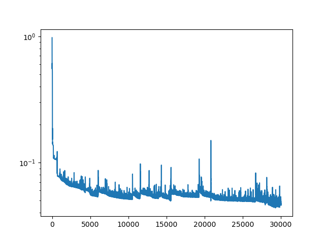
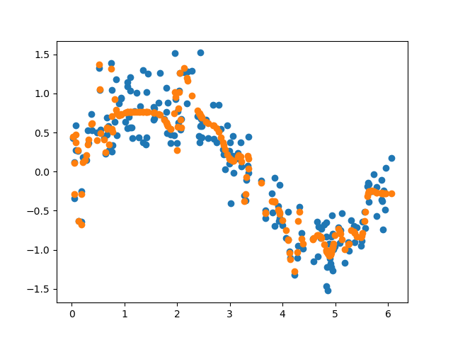

Experiments with neural networks and Jax

## Flax Neural Network for Sine Wave Approximation

The `flax_neural_network_sin.py` script demonstrates how to build and train a simple Multi-Layer Perceptron (MLP) using the Flax library to approximate a sine wave function.

Key steps in the script:
1.  **Data Generation**: It generates `N_SAMPLES` (200) data points where `x` values are uniformly distributed between 0 and 2π. The corresponding `y` values are `sin(x)` with some added Gaussian noise.
2.  **Model Definition**: A `SimpleMLP` is defined using `flax.linen.Module`. This network consists of an input layer, three hidden layers (each with 10 neurons and sigmoid activation), and an output layer (1 neuron).
3.  **Initialization**: The model's parameters are initialized.
4.  **Training Setup**:
    *   An Adam optimizer is chosen with a specified `LEARNING_RATE`.
    *   A `TrainState` object from Flax is used to manage the model's parameters, apply function, and optimizer state.
    *   A mean squared error loss function (`loss_fn`) is defined to measure the difference between the model's predictions and the true `y` values.
5.  **Training Loop**:
    *   The model is trained for `N_EPOCHS` (30,000).
    *   In each epoch, the `train_step` function (JIT-compiled for performance) calculates the loss and gradients, then updates the model's parameters.
    *   The loss is recorded at each epoch.
6.  **Results Visualization**:
    *   A plot of the loss history over epochs is generated and saved.
    *   A scatter plot comparing the original noisy sine wave data with the trained model's predictions is generated and saved.

### Results

**Loss History:**

**Inference - Model Approximation of Sine Wave:**

